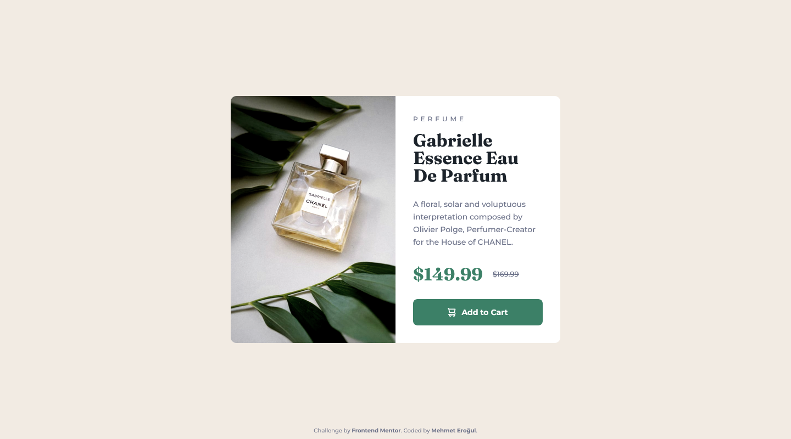

# Frontend Mentor - Product preview card component solution

This is a solution to the [Product preview card component challenge on Frontend Mentor](https://www.frontendmentor.io/challenges/product-preview-card-component-GO7UmttRfa). Frontend Mentor challenges help you improve your coding skills by building realistic projects.

## Table of contents

- [Overview](#overview)
  - [Screenshots](#screenshots)
  - [Links](#links)
- [My process](#my-process)
- [Author](#author)

## Overview

### Screenshots

### Links

- Live Site URL: [Github Pages](https://mehmeterogul.github.io/product-preview-card-component/)

## My process

### Built with

- Mobile-first workflow
- Flexbox
- CSS custom properties

## Author

- Frontend Mentor - [@mehmeterogul](https://www.frontendmentor.io/profile/mehmeterogul)
- LinkedIn - [@mehmet-erogul](https://www.linkedin.com/in/mehmet-erogul)
- Twitter - [@MehmetErogul96](https://www.twitter.com/MehmetErogul96)
